# @wbern/claude-instructions

```
       _==/          i     i          \==_
     /XX/            |\___/|            \XX\
   /XXXX\            |XXXXX|            /XXXX\
  |XXXXXX\_         _XXXXXXX_         _/XXXXXX|
 XXXXXXXXXXXxxxxxxxXXXXXXXXXXXxxxxxxxXXXXXXXXXXX
|XXXXXXXXXXXXXXXXXXXXXXXXXXXXXXXXXXXXXXXXXXXXXXX|
XXXXXXXXXXXXXXXXXXXXXXXXXXXXXXXXXXXXXXXXXXXXXXXXX
|XXXXXXXXXXXXXXXXXXXXXXXXXXXXXXXXXXXXXXXXXXXXXXX|
 XXXXXX/^^^^"\XXXXXXXXXXXXXXXXXXXXX/^^^^^\XXXXXX
  |XXX|       \XXX/^^\XXXXX/^^\XXX/       |XXX|
    \XX\       \X/    \XXX/    \X/       /XX/
       "\       "      \X/      "       /"
```

TDD workflow commands for Claude Code CLI.

## Installation

```bash
npx @wbern/claude-instructions
```

The interactive installer lets you choose:

- **Variant**: With or without [Beads MCP](https://github.com/steveyegge/beads) integration
- **Scope**: User-level (global) or project-level installation

After installation, restart Claude Code if it's currently running.

## Which Command Should I Use?

### Main Workflow

Follow this workflow from planning to shipping:

```mermaid
flowchart TB
    Start([Start New Work])

    Start --> Step1[<b>1. PLAN</b>]

    Step1 --> Issue[📋 /issue<br/>Have GitHub issue<br/><i>Requires: GitHub MCP</i>]
    Step1 --> Plan[📝 /plan<br/>No issue yet<br/><i>Optional: Beads MCP</i>]

    Issue --> Step2[<b>2. CODE with TDD</b>]
    Plan --> Step2

    Step2 -->|Manual| Red[🔴 /red<br/>Write failing test]
    Red --> Green[🟢 /green<br/>Make it pass]
    Green --> Refactor[🔵 /refactor<br/>Clean up code]
    Refactor --> MoreTests{More tests?}

    Step2 -->|Automated| Cycle[🔄 /cycle<br/>Runs red+green+refactor]
    Cycle --> MoreTests

    MoreTests -->|Yes| Step2
    MoreTests -->|No| Step3

    Step3[<b>3. SHIP</b>]

    Step3 --> Commit[📦 /commit<br/>Create commit]
    Commit --> ShipChoice{How to<br/>merge?}

    ShipChoice -->|Simple change| Ship[🚢 /ship<br/>Direct to main<br/><i>Requires: GitHub MCP</i>]
    ShipChoice -->|Show team| Show[👀 /show<br/>Auto-merge + notify<br/><i>Requires: GitHub MCP</i>]
    ShipChoice -->|Needs review| Ask[💬 /ask<br/>Create PR<br/><i>Requires: GitHub MCP</i>]

    Ship --> Done([✅ Done])
    Show --> Done
    Ask --> Done

    style Start fill:#e1f5ff
    style Step1 fill:#fff4e6
    style Step2 fill:#e8f5e9
    style Step3 fill:#fce4ec
    style Done fill:#c8e6c9
```



### Other Commands

Available anytime during your workflow:

```mermaid
flowchart TB
    Utils[<b>UTILITIES</b>]
    Utils --> Spike[🔬 /spike<br/>Exploratory coding before TDD]
    Utils --> TDD[📚 /tdd<br/>Remind agent about TDD]
    Utils --> AddCommand[➕ /add-command<br/>Create custom commands]
    Utils --> Summarize[📄 /summarize<br/>Summarize conversation<br/><i>Optional: Beads MCP</i>]
    Utils --> Gap[🔍 /gap<br/>Find unaddressed items<br/><i>Optional: Beads MCP</i>]
    Utils --> Beepboop[🤖 /beepboop<br/>AI attribution]

    Worktree[<b>WORKTREE MANAGEMENT</b>]
    Worktree --> WorktreeAdd[➕ /worktree-add<br/>Create new worktree<br/><i>Requires: GitHub MCP</i>]
    Worktree --> WorktreeCleanup[🧹 /worktree-cleanup<br/>Clean up merged worktrees<br/><i>Requires: GitHub MCP</i>]

    style Utils fill:#fff9c4
    style Worktree fill:#f3e5f5
```



## Available Commands

<!-- docs COMMANDS_LIST -->
<!-- /docs -->

## Getting Started

### Quick Start: Your First TDD Cycle

Here's a simple example to get you started with the TDD workflow:

**1. Write a failing test (`/red`)**

```
You: /red add a function that validates email addresses

Claude: I'll write a failing test for email validation.
[Creates test file with a test that checks email validation]
[Runs test - shows it failing because function doesn't exist yet]
```

**2. Make it pass (`/green`)**

```
You: /green

Claude: I'll implement the minimal code to pass the test.
[Creates the email validation function with basic implementation]
[Runs test - shows it passing]
```

**3. Refactor for quality (`/refactor`)**

```
You: /refactor extract regex pattern to a constant

Claude: I'll refactor while keeping tests green.
[Extracts magic values, improves code structure]
[Runs tests - confirms they still pass]
```

### Complete Workflow Example

**Starting from a GitHub issue:**

```
/issue 123
```

Claude analyzes the GitHub issue and creates a TDD implementation plan showing what tests to write.

**Running a full TDD cycle:**

```
/cycle implement user authentication with password hashing
```

Claude executes the complete red-green-refactor cycle: writes a failing test, implements it, then refactors.

**Individual phases for more control:**

```
/red test that users can't login with wrong password
/green
/refactor move password verification to separate function
```

**Committing and creating PRs:**

```
/commit
```

Claude reviews changes, drafts a commit message following project standards, and creates the commit.

```
/ask
```

Claude analyzes commits, creates a PR with summary and test plan.

### What to Expect

- **`/red`** - Claude writes ONE failing test based on your description
- **`/green`** - Claude writes minimal implementation to pass the current failing test
- **`/refactor`** - Claude improves code structure without changing behavior
- **`/cycle`** - Claude runs all three phases in sequence for a complete feature

The commands enforce TDD discipline: you can't refactor with failing tests, can't write multiple tests at once, and implementation must match test requirements.

## Example Conversations

<!-- docs EXAMPLE_CONVERSATIONS -->
<!-- /docs -->

## Contributing

See [CONTRIBUTING.md](CONTRIBUTING.md) for development workflow, build system, and fragment management.

## Credits

TDD workflow instructions adapted from [TDD Guard](https://github.com/nizos/tdd-guard) by Nizar.
